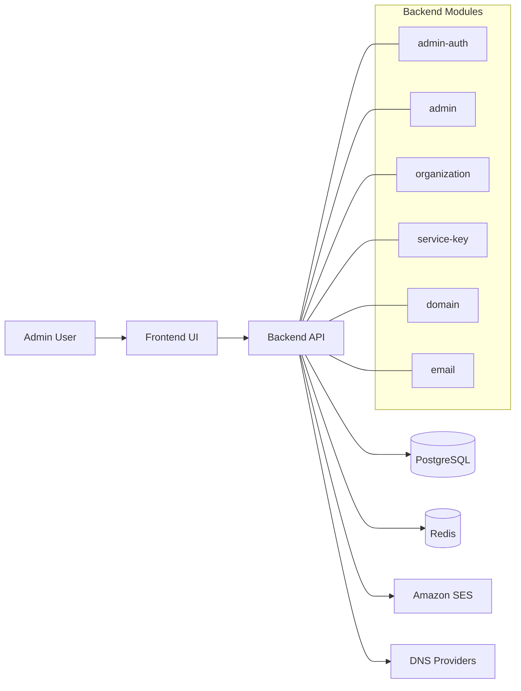
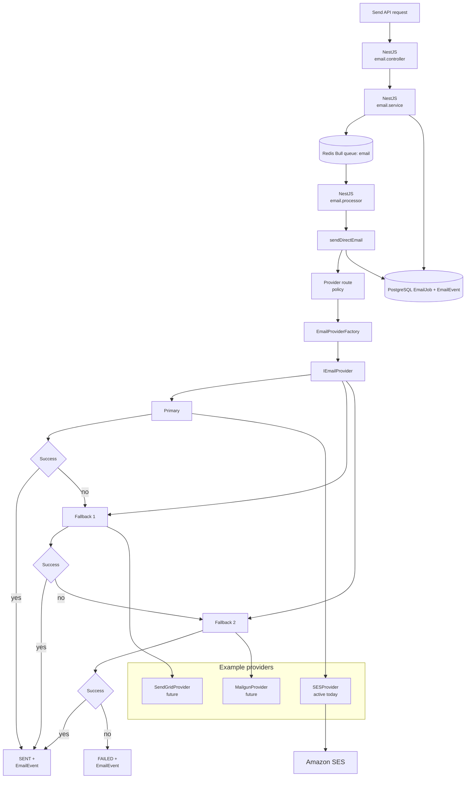

# NexSEND

NexSEND is a notification platform for managed email delivery, domain verification, and service-key based API access.

Built and maintained **by [NexMUN](https://nexmun.in)**.

## What This Repository Contains

- `apps/backend/`: NestJS API, queue workers, domain/email/services management, CLI utilities
- `apps/frontend/`: Next.js admin GUI for organizations, service keys, and domain operations
- `scripts/`: workspace helpers (for example frontend runner)

## Product + Provider Boundary

- Production runtime is currently **Amazon SES only**.
- The code structure is **provider-extensible** (interface + factory pattern), but non-SES providers are not active runtime modes today.

Do not document or advertise multi-provider runtime support as currently enabled.

## Who This README Is For

This README is the single source of truth for:

1. New developers (local setup and running everything)
2. Production operators (configuration + release checks)
3. API integrators (service-key creation and usage)

## Quick Start (Local)

## 1) Prerequisites

- Node.js 20+
- Bun 1.2+
- PostgreSQL
- Redis
- AWS credentials (for SES path validation)

## 2) Install dependencies

```bash
# repo root (installs everything via Bun workspaces)
bun install
```

## 3) Configure environment

```bash
cd apps/backend
cp .env.example .env
```

Minimum local variables to verify before running:

- `DATABASE_URL`
- `REDIS_URL`
- `EMAIL_PROVIDER=SES`
- `AWS_REGION`
- `AWS_ACCESS_KEY_ID`
- `AWS_SECRET_ACCESS_KEY`
- `FRONTEND_URL=http://localhost:3000`
- `ADMIN_ALLOWED_ORIGINS=http://localhost:3000`
- `ADMIN_SETUP_TOKEN` (optional in dev, required in prod)

## 4) Prepare DB

```bash
cd apps/backend
bun run prisma:generate
bun run prisma:migrate:dev
```

## 5) Run backend

```bash
cd apps/backend
bun run start:dev
```

Backend default API base: `http://localhost:8001/api`

## 6) Run frontend GUI

From repo root (recommended):

```bash
# dev on default port 3000
bun run frontend:dev

# dev on specific port
bun run frontend:dev:port -- --port=3100

# production build for GUI
bun run frontend:build

# start built GUI
bun run frontend:start -- --port=3000
```

Direct frontend commands:

```bash
cd apps/frontend
bun run dev
bun run build
bun run start
```

The root scripts call `scripts/frontend-runner.mjs` and forward the port to Next.js.

## GUI Routes + First Login

- `/setup`: one-time bootstrap admin creation
- `/login`: admin session login
- `/dashboard`: organizations, service keys, domains

Important:

- In production, setup requires `ADMIN_SETUP_TOKEN` and header `x-admin-setup-token`.
- Admin session uses secure cookie auth + origin checks (`FRONTEND_URL` / `ADMIN_ALLOWED_ORIGINS`).

## CLI Usage (Backend)

Backend CLI is production-oriented for service key operations and verification.

```bash
cd apps/backend
bun run cli
bun run cli -- help
bun run cli -- capabilities
bun run cli -- create-service-key
bun run cli -- create-service-key --preset=main-backend
bun run cli -- verify-production
```

Bun shortcuts:

```bash
cd apps/backend
bun run service-key:create
bun run service-key:create-main
bun run verify:production
```

## Integrator Flow (Service Key)

1. Operator creates a key via CLI (`create-service-key`).
2. Securely store returned `X-Service-Key` (one-time display).
3. Use key in requests via `X-Service-Key` header.
4. Use dashboard or CLI to rotate/regenerate when needed.

## Verification + Quality Gates

Run these before shipping:

```bash
# backend
cd apps/backend
bun run build
bun run test

# frontend
cd ../frontend
bun run lint
bun run build
```

`bun run test` (from `apps/backend`) currently runs:

- SES production-readiness verification
- Admin dashboard readiness verification (auth lifecycle, origin policy, contract checks)

## Production Runbook (Operator)

## Required production env posture

- `NODE_ENV=production`
- `EMAIL_PROVIDER=SES`
- valid AWS SES credentials + region
- valid DB + Redis connectivity
- explicit admin origin allowlist:
  - `FRONTEND_URL`
  - `ADMIN_ALLOWED_ORIGINS`
- `ADMIN_SETUP_TOKEN` set to a strong random token

## Release checklist

1. Build + tests green (`backend`, `frontend`)
2. SES credentials path validated
3. Domain verification flow validated
4. Queue processing validated
5. Health endpoint validated (`/api/health`)
6. Service keys provisioned and vaulted securely

See also: `apps/backend/PUBLIC_LAUNCH_CHECKLIST.md`.

## Architecture Overview

Core backend modules:

- `admin-auth`: bootstrap/login/session cookie auth for admin GUI
- `admin`: dashboard-facing management endpoints
- `organization`: org management
- `service-key`: API key lifecycle and permissions
- `domain`: DNS + verification lifecycle
- `email`: send path + provider factory + queue processor

## Infrastructure Diagram (Mermaid)



Infra notes:

- Frontend UI: Next.js app (`/setup`, `/login`, `/dashboard`)
- Backend API: NestJS at `http://localhost:8001/api`
- Data/services: PostgreSQL, Redis, Amazon SES, DNS providers

High-level flow:

1. Admin signs in via GUI
2. Admin manages orgs, keys, domains
3. Integrator sends requests with service key
4. Backend validates key and queues work
5. Worker processes email using SES provider

## Email Delivery + Provider Architecture (Mermaid)



Diagram legend:

- `REQ` -> API `send` / `send-bulk` request entry
- `SVC` -> creates `EmailJob` and enqueues work in Redis Bull queue
- `Q` / `PROC` -> Redis/Bull queue processing path in NestJS worker
- `ROUTE` -> provider selection policy (org + service key + config)
- `FACT` / `IFACE` -> factory + `IEmailProvider` abstraction
- `P1/P2/P3` -> primary and fallback provider attempts
- `DB` -> PostgreSQL records (`EmailJob`, `EmailEvent`)

Flow notes:

- Route policy = org + service-key + config/health rules
- Provider factory = resolves provider order
- Current runtime = SES only
- Future runtime = primary + fallback providers
- Email queue = Bull queue (`email`)

Provider-extensibility notes:

- Interface: `apps/backend/src/modules/email/interfaces/email-provider.interface.ts`
- Factory: `apps/backend/src/modules/email/factories/email-provider.factory.ts`
- Active runtime provider today: SES only
- Multi-provider support model (future): add additional `IEmailProvider` implementations, register them in factory, and resolve primary/fallback route per request

## GUI Naming / Rebranding Guide

Canonical product name in docs/UI: **NexSEND**

Attribution text where needed: **by NexMUN** linking to `https://nexmun.in`.

To rename visible GUI brand/title strings, update:

- `apps/frontend/app/layout.tsx` (metadata title/description)
- `apps/frontend/app/dashboard/page.tsx` (header title/subtitle)
- any additional labels in `apps/frontend/app/*` or `apps/frontend/components/*`

After renaming:

```bash
cd apps/frontend
bun run lint
bun run build
```

## Troubleshooting

## Frontend cannot reach backend

- Ensure backend is running on `:8001`
- Set `NEXT_PUBLIC_BACKEND_URL` if not using default `http://localhost:8001/api`
- Verify CORS origins in backend env

## Admin cookie/session issues

- Confirm `FRONTEND_URL` and `ADMIN_ALLOWED_ORIGINS`
- In production, ensure HTTPS and `secure` cookie-compatible environment

## Setup endpoint blocked

- In production, verify `ADMIN_SETUP_TOKEN` is set
- Send `x-admin-setup-token` header with matching value

## SES verification failures

- Check AWS credentials and region
- Re-run `cd apps/backend && bun run verify:production`

## Deep References

Use this README as the primary source; use these for depth:

- Backend CLI details: `apps/backend/CLI.md`
- Backend service overview: `apps/backend/docs/README.md`
- Launch checklist: `apps/backend/PUBLIC_LAUNCH_CHECKLIST.md`
- API integration details: `apps/backend/docs/BACKEND_INTEGRATION_GUIDE.md`
- Service key API details: `apps/backend/docs/SERVICE_KEY_MANAGEMENT_API.md`

## License

Licensed under MIT. See `LICENSE`.

---

NexSEND by [NexMUN](https://nexmun.in)
